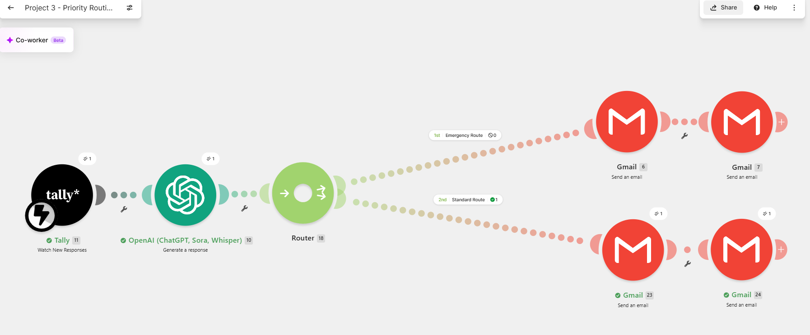

# AI Lead Response System

## Overview

This project is an AI-powered lead response and qualification system built using **Tally, Make, OpenAI, and Gmail**.

It is designed for home-service businesses such as garage door repair, HVAC, plumbing, electrical, roofing, restoration, and property management companies.

The automation captures customer service requests, analyzes them using AI, prioritizes urgent leads, and automatically sends notifications to both the business owner and the customer.

---

## Business Problem

Many service businesses receive customer inquiries by email or website forms and manually review every request.

This can result in:
- Slower response times
- Missed opportunities
- Difficulty identifying emergency requests
- Increased administrative work

---

## Solution

The workflow automatically:

1. Captures a customer service request through Tally.
2. Sends the request to OpenAI for analysis.
3. Determines:
   - Priority
   - Urgency
   - Service category
   - AI-generated summary
4. Routes the request based on urgency.
5. Sends the appropriate notification to the business owner.
6. Sends an automatic confirmation email to the customer.

---

## Technologies Used

- OpenAI API
- Make
- Tally
- Gmail
- Prompt Engineering

---

## Workflow

Customer Form (Tally)
↓
Make Automation
↓
OpenAI Lead Qualification
↓
Priority Router
├── Emergency Notification
└── Standard Notification
↓
Customer Confirmation Email

---

## Features

- AI-powered lead qualification
- Automatic priority detection
- Emergency vs. standard routing
- Business owner notifications
- Customer confirmation emails
- Professional HTML email formatting

---

## Future Improvements

- SMS notifications
- Appointment scheduling
- CRM integration
- AI chatbot
- Dashboard and reporting
- AI voice receptionist

---

## Author

Created by Yayeh Ismael as part of an AI Automation portfolio.

##screenshots

###Customer Form

###Make Workflow

### OpenAI Output

### Emergency Email

